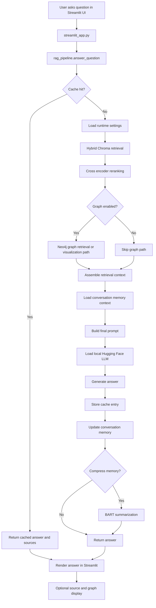

# research-llm (legacy) Technical Documentation

## 1. Overview

`research-llm` is a local, research oriented Retrieval Augmented Generation system that answers questions over a Sy([raw.githubusercontent.com](https://raw.githubusercontent.com/AryanApte1408/research-llm/legacy/rag_pipeline.py))legacy branch combines:

* **Streamlit** for the user interface
* **ChromaDB** for vector storage and semantic retrieval
* **Neo4j** for optional researcher and paper graph expansion
* **SQLite** as the source of record for research metadata and full text
* **Hugging Face Transformers** for local answer generation and summarization
* **JSON backed local cache and conversation memory** for response reuse and session continuity

At a high level, the application ingests research data from SQLite into Chroma and optionally Neo4j, retrieves semantically relevant documents for a user query, merges retrieval context with conversation memory, and runs a local LLM to produce the answer.

---

## 2. Goals and Intended Use

The system is designed to support:

* question answering over institutional research data
* retrieval over full text papers or abstracts
* optional graph exploration for researcher and paper relationships
* local inference without requiring a hosted LLM API
* persistence of lightweight cache and session memory on disk

Typical use cases include:

* asking about a researcher’s publications
* querying topics across a local paper corpus
* exploring relationships among researchers, papers, and authors
* building a self hosted academic search assistant

---

## 3. Repository Structure

### Core application files

* `streamlit_app.py`
  Streamlit UI entrypoint
* `rag_pipeline.py`
  End to end question answering pipeline
* `runtime_settings.py`
  Mutable runtime toggles for active database, graph usage, and LLM model choice
* `config_full.py`
  Static path and database configuration

### Retrieval layer

* `hybrid_langchain_retriever.py`
  Chroma vector retrieval plus cross encoder reranking
* `chroma_retriever.py`
  Simpler Chroma retrieval path with year based sorting
* `graph_retriever.py`
  Neo4j researcher oriented lookup
* `graph_visualizer.py`
  Streamlit graph rendering for retrieved graph hits

### Memory and caching

* `cache_manager.py`
  File based answer cache
* `conversation_memory.py`
  Persistent conversation summarization and paper memory

### Data ingestion and validation

* `chroma_ingest_full.py`
  Builds full text Chroma collection from SQLite
* `chroma_ingest_abstracts.py`
  Builds abstract only Chroma collection
* `neo_ingest.py`
  Builds Neo4j graph from full research dataset
* `neo_ingest_abstracts.py`
  Builds simplified Neo4j graph from abstract dataset
* `api_abstract_retriever.py`
  Builds an abstract database from external APIs
* `data_check.py`
  Database or dataset verification utility
* `pdfs.py`
  PDF oriented helper or extraction utility
* `test_chroma.py`
  Retrieval validation script
* `database_manager.py`
  Configuration registry for full and abstract database modes

---

## 4. Architecture

## 4.1 Mermaid Flow Diagram

## 4.2 Logical Architecture

The system consists of five major layers:

1. **Data sources**
   SQLite databases containing research metadata, summaries, and paper text

2. **Indexing layer**
   ChromaDB collections for semantic search and Neo4j for graph traversal

3. **Retrieval layer**
   Vector search, reranking, optional graph query, and metadata normalization

4. **Reasoning layer**
   Local Hugging Face causal language model for answer generation plus summarization model for memory compression

5. **Presentation layer**
   Streamlit chat UI with optional graph visualization and source display

---

## 5. Component Documentation

## 5.1 `streamlit_app.py`

### Purpose

Provides the interactive chat UI.

### Responsibilities

* initializes the Streamlit page
* exposes runtime controls in the sidebar
* stores chat history in `st.session_state`
* sends user prompts to the RAG pipeline
* displays answers and source context
* optionally renders a graph visualization
* provides actions for cache clearing and memory reset

### Sidebar controls

* database mode selection
* LLM model selection
* graph expansion toggle
* clear answer cache
* reset memory summary
* clear chat log

### Notes

The UI assumes the pipeline response contains:

* `answer`
* `sources`
* optionally `graph_hits`

This contract is only partially met by the current pipeline and retriever stack.

---

## 5.2 `rag_pipeline.py`

### Purpose

Implements the main question answering orchestration.

### Main functions

#### `_load_llm()`

Loads one of two local Llama model variants based on runtime settings.

#### `_free_vram_k()`

Estimates a retrieval count heuristic from available GPU memory.

#### `answer_question(q)`

Main pipeline:

1. check cache
2. retrieve documents
3. gather memory context
4. build prompt
5. run generation
6. store answer and sources
7. update conversation memory
8. compress memory when needed

### Prompt strategy

The prompt includes:

* a fixed system instruction describing the assistant as a Syracuse research RAG assistant
* serialized conversation memory
* the current user question
* retrieved context passages

### Model behavior

* uses `AutoTokenizer`
* uses `AutoModelForCausalLM`
* auto selects CUDA when available
* generation parameters currently use a low temperature and moderate nucleus sampling

### Important limitation

The current implementation expects the retriever result to contain `result["chroma_ctx"]`, but the active retriever returns a list of ranking objects rather than a dict. This is a breaking interface mismatch and must be fixed before production use.

---

## 5.3 `runtime_settings.py`

### Purpose

Stores mutable runtime flags in a lightweight singleton style object.

### Settings

* `active_mode`
  `full` or `abstracts`
* `use_graph`
  enables optional graph retrieval and visualization
* `llm_model`
  selects between 1B and 3B local Llama variants

### Notes

The settings object is mutated directly by the Streamlit UI. This is simple but not thread safe and assumes a single process, low concurrency deployment.

---

## 5.4 `config_full.py`

### Purpose

Provides static configuration constants.

### Currently defined values

* full SQLite path
* full Chroma directory
* Chroma collection name
* embedding model name
* Neo4j connection settings

### Notes

This file currently hard codes Windows specific local paths. It should be considered environment specific, not portable.

### Design issue

Multiple other modules expect additional abstract mode constants such as:

* `SQLITE_DB_ABSTRACTS`
* `CHROMA_DIR_ABSTRACTS`
* `COLLECTION_ABSTRACTS`
* `COLLECTION_FULL`
* `ACTIVE_MODE`
* `SENTENCE_TFORMER`

These are not present in the current config file, which means abstract mode and some helper utilities cannot run without extending configuration.

---

## 5.5 `hybrid_langchain_retriever.py`

### Purpose

Performs semantic retrieval from Chroma and reranks candidates with a cross encoder.

### Retrieval strategy

1. open Chroma collection based on active mode
2. estimate a dynamic candidate count using available RAM and optionally GPU memory
3. run vector search with `intfloat/e5-base-v2`
4. normalize metadata into a common schema
5. rerank passages with `cross-encoder/ms-marco-MiniLM-L-6-v2`
6. select top papers above a score threshold
7. trim long `text` and `snippet` fields

### Output structure

Returns a list of dicts with fields such as:

* `id`
* `title`
* `year`
* `authors`
* `researcher`
* `snippet`
* `text`
* `similarity`

### Strengths

* better ranking quality than plain vector search
* metadata normalization across slightly inconsistent data sources
* adaptive candidate sizing
* paper level grouping before final selection

### Limitation

The collection name is hard coded as `papers_all` in `get_chroma()`, even when `active_mode` is `abstracts`. That means the abstract mode collection handling is incomplete.

---

## 5.6 `chroma_retriever.py`

### Purpose

Simpler retrieval implementation for direct Chroma querying.

### Behavior

* selects collection based on runtime mode
* queries Chroma with a sentence transformer embedder
* sorts results by publication year descending
* optionally filters by distance threshold

### Use case

Useful as a fallback or test path when reranking is unnecessary.

### Limitation

This module depends on config constants that are not fully defined in the current configuration file.

---

## 5.7 `graph_retriever.py`

### Purpose

Provides researcher specific lookup against Neo4j.

### Main capabilities

* detect whether a user query mentions a known researcher name
* fetch papers strictly associated with that researcher
* include connected author information
* sort papers by year descending

### Neo4j model assumptions

The code expects nodes and relationships such as:

* `(:Researcher {name})`
* `(:Paper {paper_id, title, year, doi_link})`
* `(:Author {name})`
* `(:Researcher)-[:WROTE]->(:Paper)`
* `(:Paper)-[:HAS_RESEARCHER]->(:Researcher)`
* `(:Paper)-[:HAS_AUTHOR]->(:Author)`

### Limitation

The module currently appears to implement only strict researcher mode and not broader graph expansion from arbitrary retrieval results.

---

## 5.8 `graph_visualizer.py`

### Purpose

Renders graph hits inside Streamlit using `streamlit_agraph`.

### Features

* wraps long node labels for readability
* styles Researchers, Authors, and Papers differently
* reconstructs graph elements from path results returned by Neo4j
* supports visualization by paper id, paper title, or researcher name

### Return values

`render_graph_from_hits()` returns:

* the graph visualization object
* the Cypher query used
* the query parameters

### Notes

This is mainly a presentation layer utility. It depends on upstream components returning graph hits in the expected shape.

---

## 5.9 `cache_manager.py`

### Purpose

Stores previously generated answers by question hash.

### Storage model

* cache directory: `~/.rag_memory`
* file: `answer_cache.json`
* key: SHA256 hash of the normalized question

### Stored fields

* original question
* generated answer
* source list

### Characteristics

* persistent across app restarts
* simple and easy to debug
* not safe for concurrent writers
* no expiration, invalidation policy, or versioning beyond manual clear

---

## 5.10 `conversation_memory.py`

### Purpose

Maintains persistent conversational context and summarizes it when the recent turn buffer grows.

### Stored state

* `summary`
* `recent_turns`
* `paper_summary`
* `paper_ids`

### Files

* directory: `~/.rag_memory`
* file: `session_memory.json`

### Summarization model

Uses `facebook/bart-large-cnn` for:

* compressing recent interactions into long term memory
* summarizing newly seen papers into a paper memory summary

### Main functions

* `add_turn()`
* `should_compress()`
* `compress_memory()`
* `update_paper_memory()`
* `get_memory_context()`
* `reset_memory()`

### Notes

This module is more complete than the UI integration. The Streamlit app resets local variables instead of calling `reset_memory()`, so the on disk memory file may not actually be cleared by the current UI behavior.

---

## 5.11 `database_manager.py`

### Purpose

Provides an abstraction for switching between full and abstract database configurations.

### Functions

* register named configs
* switch active config
* list configs
* ensure Chroma directories exist

### Notes

This is useful as a foundation for multi corpus support, but it is not consistently used across the runtime. Most modules still read directly from `runtime_settings` and `config_full`.

---

## 5.12 `chroma_ingest_full.py`

### Purpose

Builds a full text Chroma collection from SQLite.

### Source tables

* `research_info`
* `works`

### Ingestion behavior

* detects whether the full text column is named `full_text`, `fultext`, or `fulltext`
* joins metadata from `research_info` with summary and full text from `works`
* builds one canonical paper document per `paper_id`
* splits very large documents into chunks
* stores chunk metadata including chunk index and total chunk count

### Metadata included

* `paper_id`
* `research_info_id`
* `researcher`
* `title`
* `authors`
* `doi`
* `year`
* `publication_date`
* `primary_topic`

### Strengths

* robust to minor SQLite schema drift for full text column naming
* deduplicates by paper id
* keeps enough metadata for downstream ranking and display

---

## 5.13 `chroma_ingest_abstracts.py`

### Purpose

Builds an abstract only Chroma collection.

### Source table

* `abstracts_only`

### Stored metadata

* DOI
* title
* source
* year

### Notes

This is a simpler ingest path intended for a smaller or more lightweight retrieval corpus.

### Limitation

The script depends on abstract mode configuration values that are not present in the current config file.

---

## 5.14 `neo_ingest.py`

### Purpose

Builds or updates a Neo4j graph from the full SQLite research database.

### Features

* reads Neo4j credentials from environment variables first, then config fallback
* validates authentication early
* detects full text column naming variants
* parses metadata such as dates, DOIs, URLs, and author lists
* batches writes into Neo4j
* uses configurable worker and batch sizes

### Likely graph entities

* Researcher
* Paper
* Author
* possibly additional metadata nodes depending on the remainder of the script

### Operational role

This is the primary script for constructing the graph used by graph retrieval and visualization.

---

## 5.15 `neo_ingest_abstracts.py`

### Purpose

Builds a simplified graph from abstract data.

### Graph model

* `(:Paper {doi, title, year})`
* `(:Source {name})`
* `(:Year {value})`
* `(:Source)-[:PUBLISHED]->(:Paper)`
* `(:Year)-[:CONTAINS]->(:Paper)`

### Notes

This graph is intentionally much simpler than the full graph and does not model authors or researchers.

---

## 5.16 Other utility files

### `api_abstract_retriever.py`

Builds an `abstracts_only.db` dataset from external scholarly APIs. It appears to prioritize Crossref and OpenAlex.

### `pdfs.py`

Likely contains PDF extraction or paper preprocessing helpers.

### `data_check.py`

Likely validates source database content or ingest assumptions.

### `test_chroma.py`

Validation script for checking Chroma retrieval behavior.

Because these files were not central to the application runtime path, they should be documented as support utilities rather than core services.

---

## 6. Data Model

## 6.1 SQLite

The full ingest path indicates at least two key tables.

### `research_info`

Likely contains:

* `id`
* `paper_id`
* `researcher_name`
* `work_title`
* `authors`
* `info`
* `doi`
* `publication_date`
* `primary_topic`

### `works`

Likely contains:

* `paper_id`
* `summary`
* one of `full_text`, `fultext`, or `fulltext`

### `abstracts_only`

Contains:

* `doi`
* `title`
* `abstract`
* `source`
* `year`

---

## 6.2 Chroma metadata schema

Full ingest stores metadata such as:

* `paper_id`
* `research_info_id`
* `researcher`
* `title`
* `authors`
* `doi`
* `year`
* `publication_date`
* `primary_topic`
* `chunk`
* `chunks_total`

Retriever normalized output additionally includes:

* `snippet`
* `text`
* `similarity`

---

## 6.3 Neo4j graph schema

### Full graph

Expected entities and relationships:

* `Researcher`
* `Paper`
* `Author`
* `Researcher-[:WROTE]->Paper`
* `Paper-[:HAS_RESEARCHER]->Researcher`
* `Paper-[:HAS_AUTHOR]->Author`

### Abstract graph

Simplified entities:

* `Paper`
* `Source`
* `Year`

---

## 7. End to End Execution

## 7.1 Index build workflow

### Full corpus

1. Prepare `syr_research_all.db`
2. Configure `config_full.py`
3. Run `chroma_ingest_full.py`
4. Optionally run `neo_ingest.py`

### Abstract corpus

1. Prepare or generate `abstracts_only.db`
2. Extend config with abstract mode paths
3. Run `chroma_ingest_abstracts.py`
4. Optionally run `neo_ingest_abstracts.py`

## 7.2 Serving workflow

1. Launch Streamlit app
2. Select runtime database mode and LLM in sidebar
3. Ask a question
4. Retrieve context and generate answer
5. Inspect sources and graph output

---

## 8. Installation and Setup

## 8.1 Python dependencies

Based on imports, the project requires at minimum:

* `streamlit`
* `torch`
* `transformers`
* `sentence-transformers`
* `chromadb`
* `neo4j`
* `psutil`
* `tqdm`
* `streamlit-agraph`

There is no complete package manifest visible in the branch root, so dependency installation is currently manual.

## 8.2 Environment requirements

* Python 3.10 or newer recommended
* local access to SQLite database files
* local storage for Chroma persistence
* optional local Neo4j instance for graph features
* enough RAM and ideally GPU memory for local embedding and LLM inference

## 8.3 Configuration steps

1. clone the repository
2. edit `config_full.py` to point at your local SQLite and Chroma paths
3. add missing abstract mode constants if you need abstract support
4. ensure local Llama model paths exist for `LLAMA_3B` and `LLAMA_1B`
5. set Neo4j credentials in environment variables or config
6. ingest Chroma and optionally Neo4j
7. run Streamlit

## &#x20;Conclusion

The legacy `research-llm` branch is a promising local hybrid RAG prototype for academic research discovery. Its architecture already covers indexing, retrieval, reranking, graph support, conversation memory, caching, and local generation. However, the codebase is still in an integration phase rather than a production ready state. The most important work is to unify configuration, fix runtime contract mismatches, and formalize the retrieval to generation pipeline.

Once these gaps are addressed, the repository can serve as a strong foundation for a self hosted research assistant over institutional publication data.
